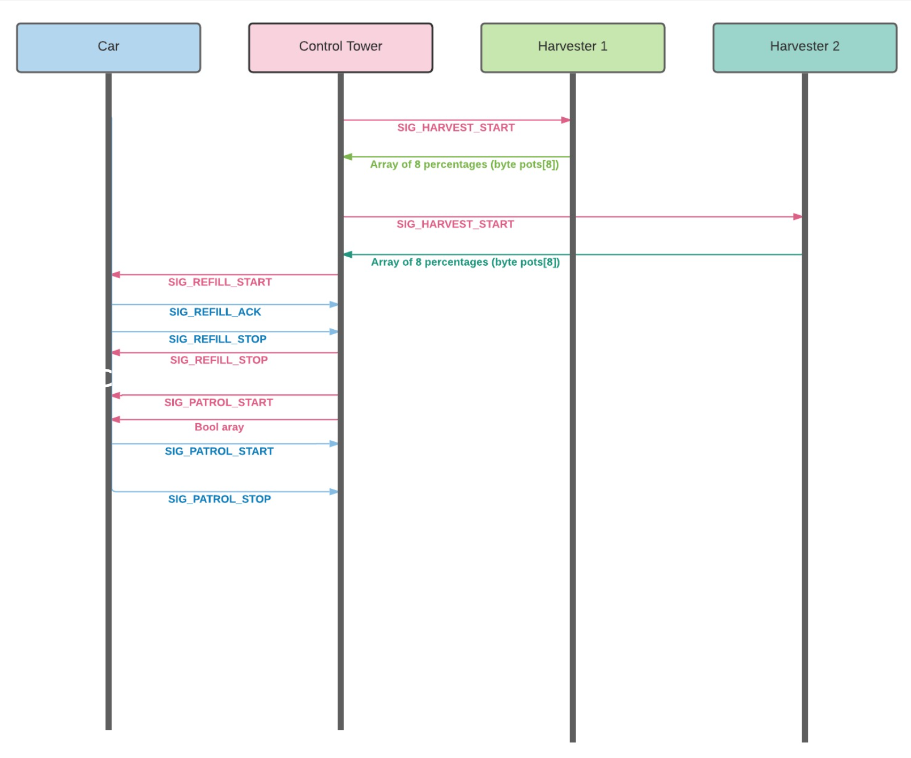

# Aquarius

Mobile watering system, capable of gathering and visualising data regarding humidity.

## System Diagram

## Workflow

## Hardware

### Harvesters
* Arduino NANO V3 ATmega328p
* NRF24L01
* Capacitive Soil Moisture Sensor

### Truck
* Arduino MEGA 2560 
* NRF24L01
* TCRT5000
* HC-SR04
* Stepper Motor
* Pump

### Control Tower
* Arduino MEGA 2560 
* NRF24L01
* W5100 Ethernet Shield

## Demo

Videos can be found in the media folder.